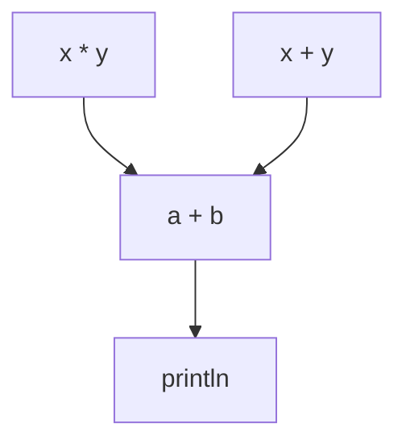
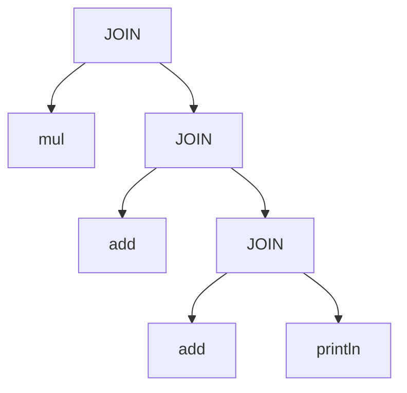

# Merkalized Abstract Syntax Tree (MAST)

This document describes the binary format for a MAST _forest_, i.e. a collection of one or more MAST trees, where each tree represents a single procedure in Miden Assembly.

A MAST forest can come in two varieties:

* A _program_, canonically represented as an _arborescence_, i.e. a forest with a single root that reaches all other roots in the forest by some path. That root is the program entrypoint, e.g. `main`.
* A _library_, which is always either a single tree, or a collection of trees. Some of the trees may form an arborescence, reflecting sets of functions which are only reachable through some top-level function.

The MAST is formed from some non-empty set of _nodes_. Nodes correspond to the control flow structure of the program being represented; the type of node determines the control semantics, and _edges_ connecting the node to other nodes determines the scheduling of operations. A special node type, the _basic block_, is used to represent a sequence of primitive operations without intra-procedural control flow, i.e. branches and loops. Nodes have either zero or one parent, and may have zero or more children (though in practice the number of children is bounded to 2 for reasons of convenience related to how MAST digests are computed).

## In-Memory Structure

Before we can specify the binary format, let's define the concrete structure for a MAST forest and it's constituent parts. This is done below, with notes calling out specific details that are of interest.

First, the actual MAST structure is represented by the `MastForest` type:

```rust
pub struct MastForest {
    /// All of the blocks local to the trees comprising the MAST forest
    nodes: Vec<MastNode>,
    /// Dense bitset where each set bit indicates that the corresponding
    /// index in `nodes` is a MAST root.
    roots: SmallVec<[u64; 1]>,
    /// The "entrypoint", when set, is the root of the entire forest, i.e.
    /// a path exists from this node to all other roots in the forest. This
    /// corresponds to the executable entry point. When not set, the forest
    /// may or may not have such a root in `roots`, but is not required.
    /// Whether or not the entrypoint is set distinguishes a MAST which is
    /// executable, versus a MAST which represents a library.
    ///
    /// NOTE: The entrypoint is also present in `roots` if set
    entrypoint: Option<MastNodeId>,
}
```

This representation is "flattened", i.e. the nodes of the tree are stored in a vector, and edges between nodes are implied by referencing a node by its index in that vector. This will be more clear as we fill out the types mentioned above.

This representation allows constant-time access to any node in the tree, as well as constant-time appends/insertions. Additionally, because all of the nodes are stored contiguously; and generally stored such that nodes in close proximity in the tree, are also close in the vector - accessing nearby nodes in the tree benefits from those nodes frequently being in the same cache line, or in a nearby cache line. It also has the effect of dramatically simplifying serialization/deserialization.

The downside is that the tree structure is no longer enforced by the type system, instead we must maintain those invariants ourselves. This is a tradeoff, but one we've determined is worth making.

Next, let's take a closer look at the definition of `MastNode` and the handle type used to reference `MastNode`s associated with a specific instance of `MastForest`:

```rust
/// We're using this simple type alias to reflect the fact that `MastNodeId`
/// is ultimately an index into the `nodes` vector of a `MastForest`. However,
/// in practice this is a more complex type that provides us with some
/// additional guarantees/safety, and guards against accidental misuse.
pub type MastNodeId = usize;

pub enum MastNode {
    /// See note following this snippet
    Block(BasicBlockNode),
    Join(JoinNode),
    Split(SplitNode),
    Loop(LoopNode),
    Call(CallNode),
    Dyn(DynNode),
    /// A reference to a node whose definition is not
    /// local to the containing `MastForest`.
    External(Digest),
}
```

> [!NOTE]
> I'm using the "basic block" nomenclature here for clarity, and to better reflect its relationship to the semantics of basic blocks as they are known in standard compiler IRs and assemblers.
>
> In the current `miden-core` code, "block" is used for many things that are not actually blocks, or even block-like. This in turn seems to have forced the use of "span" to represent basic blocks. Since we've been starting to favor a more graph-theoretic set of terms for MAST in recent discussions, e.g. "tree"/"forest"/"node", I think it is clearer if we discard the previous usage of "block" in favor of "node", and "span" in favor of "basic block".

The definitions of the concrete node types largely match what exists today, but we will look at them anyway just to illustrate any differences.

First, a few preliminaries. We reference two traits which currently do not exist, but which represent common functionality across node types. We assume that they are derivable for purposes of this document:

```rust
pub trait MerkleTreeNode {
    fn digest(&self) -> Digest;
}

pub trait Decorated {
    fn decorators(&self) -> &DecoratorList;
    fn decorate(&mut self, decorators: DecoratorList);
}
```

Let's start with the _basic block_, which is what comprises the majority of leaf nodes in the MAST:

```rust
#[derive(MerkleTreeNode, Decoratable)]
pub struct BasicBlockNode {
    /// The primitive operations contained in this basic block.
    ///
    /// The operations are broken up into batches of 8 groups,
    /// with each group containing up to 9 operations, or a
    /// single immediates. Thus the maximum size of each batch
    /// is 72 operations. Multiple batches are used for blocks
    /// consisting of more than 72 operations.
    batches: Vec<OpBatch<8>>,
}

pub struct OpBatch<const BATCH_SIZE: usize = 8> {
    ops: Vec<Operation>,
    groups: [Felt; BATCH_SIZE],
    op_counts: [usize; BATCH_SIZE],
    num_groups: usize,
}
```

As you can see, this node type has no other nodes as children, instead it has a finite set of `Operation`, which are the primitive operations corresponding to Miden's instruction set. Basically what you'd expect in a basic block.

Next, let's take a look at the `Join` node type, which is used for scheduling. What do I mean by scheduling? Consider the following Rust program:

```
pub fn start(x: usize, y: usize) {
    let a = x * y;
    let b = x + y;
    let c = a + b;
    println!("{c}");
}
```

While the code implies that `let a = x * y` will be executed before `let b = x + y;`, that isn't necessarily the case. In fact, the compiler can emit code to execute these expressions in any order it likes. We refer to a specific ordering, a _schedule_, and the work of constructing a schedule, _scheduling_.

With that out of the way, let's see how `Join` is used to impose a schedule on the control flow graph of a program. First, the control flow graph:



Which could be represented in MAST as the following (assuming for a moment that basic blocks don't exist, and each primop is its own node type):



So, with all of that in mind, let's look at the definition of `JoinNode`:

```rust
#[derive(MerkleTreeNode)]
pub struct JoinNode {
    children: [MastNodeId; 2],
}
```

Not much to it!

The `Split` node type is functionally identical in representation, but unlike `Join`, is not a scheduling node, but a control flow node. It only executes one of its children, depending on a boolean value on top of the operand stack.

```rust
#[derive(MerkleTreeNode)]
pub struct SplitNode {
    children: [MastNodeId; 2],
}
```

The `Loop` node type represents a condition-controlled loop. If the condition is true, then the loop body is entered, otherwise the loop body is skipped.

```rust
#[derive(MerkleTreeNode)]
pub struct LoopNode {
    body: MastNodeId,
}
```

The `Call` node type represents execution of a procedure which is known statically, using the semantics of the `call` (or `syscall`) instruction:

```rust
#[derive(MerkleTreeNode)]
pub struct CallNode {
    callee: MastNodeId,
    is_syscall: bool,
}
```

The `Dyn` node type represents execution of a procedure which is known dynamically (i.e. at runtime), using `exec` semantics. The callee is provided via the operand stack, and thus `DynNode` is a singleton zero-sized type, as it has no data to represent.

```rust
pub struct DynNode;
```

The `External` node type allows us to reference `MastNode`s which are not stored in the current `MastForest` by their digest. This is what allows us to do two useful things:

* Strip out parts of a program that will not be used, either because we want to keep those parts secret, or to reduce the size of the program - while preserving the integrity of the program's hash.
* Enable a much greater degree of code reuse, and reduce the size of MAST packages. Specifically, rather than constructing a single `MastForest` representing all of the code for a given program/library and all of its dependencies; the dependencies can be referenced as external nodes, and only code unique to the program/library need be encoded in the `MastForest`.

External nodes do not sacrifice any properties of the MAST, because they preserve the integrity of the MAST hash, and have the exact same semantics as if the referenced node was part of the same `MastForest`. The primary difference is that if the referenced node is not available at runtime for some reason, then any attempt to execute that node will fail.

### Binary Format

We can now cover the binary format for the structure we've outlined above. The two are independent of one another, but are designed such that serializing/deserializing between them is simple and efficient. First, we will cover the specification for the binary format itself, and then we will cover the specific serialization/deserialization procedures for the in-memory structure we've defined.

#### Overview

To make the specification easier to understand at a glance, we're going to use Rust code to define the layout, with the following modified syntax/semantics:

* All structs are assumed to use `#[repr(C)]` unless a different `#[repr]` is given, or modifications are otherwise noted
* We relax the restriction on dynamically-sized fields in the middle of structs,
as otherwise it would not be possible to express the format in Rust syntax
* We allow specifying the size of array-typed fields using self-referential expressions, as long as the referenced fields in the expression precede the array-typed field. For example, `items: [T; self.len]` is valid if the `len` field preceds the `items` field in the struct definition.

#### Variable-Width Integers

First, let's introduce a type that we will use throughout the rest of this spec, `VInt64`. It represents a variable-width, unsigned, little-endian 64-bit integer. It is encoded as one or more bytes, where each byte has 7 bits to represent the value, with the last bit used to signal when another byte is needed to represent the encoded value. In this case, unless otherwise noted, we treat it as an error if a `VInt64`-encoded integer would not fit in the integral type given.

See [vint64](https://docs.rs/vint64/latest/vint64/) for more details on the representation/encoding.

#### Encoding

The following is the binary encoding of a `MastForest` using our specification language as described above:

```rust
#[repr(C)]
pub struct EncodedMastForest {
    /// The magic string `b"MAST\0"`, for detecting that a file
    /// is binary-encoded MAST
    magic: [u8; 5],
    /// The format version, initially all zeros
    ///
    /// If future modifications are made to this format, the version
    /// should be incremented by 1. A version of 0b111 is reserved
    /// for future extensions that require extending the version
    /// field itself, but should be considered invalid for now.
    version: [u8; 3],
    /// The index of the node corresponding to the entrypoint
    ///
    /// This index is shifted by 1, so that zero represents None, and
    /// any positive integer represents `Some(index + 1)`.
    entrypoint: VInt64,
    /// The number of nodes contained in the forest.
    ///
    /// This tells us exactly how many elements are in `node_infos`
    node_count: VInt64,
    /// The roots bitset.
    ///
    /// There is one byte for every 8 nodes in the set, rounded to the
    /// nearest multiple of 8.
    roots: [u8; (self.node_count / 8) + (self.node_count % 8 > 0 as usize)],
    /// Metadata about the nodes in the forest.
    ///
    /// These records are the same size, allowing us to access any node
    /// in the forest directly without having to traverse the entire file.
    /// Any extra data associated with a given node is stored in the trailing
    /// data section, the location of which is given by `info.offset`
    node_infos: [MastNodeInfo; self.node_count],
    /// The size of the `strings` table, which is used to encode
    /// string constants, de-duplicated and packed.
    strings_count: VInt64,
    /// The strings table.
    ///
    /// The actual string content is stored in `data`
    strings: [StringRef; self.strings_count],
    /// The total size of the trailing `data` section
    ///
    /// While this value can be computed by fully decoding the MAST, we
    /// want to make it convenient to embed this format in another one,
    /// so having this field allows skipping past the MAST data by only
    /// decoding a couple of VInt64-encoded integers.
    data_size: VInt64,
    /// Represents that the remainder of the buffer are unstructured
    /// bytes used to store the data for various fields that can have
    /// extra data associated with them.
    ///
    /// This data must be smaller than 2^32 bytes.
    data: [u8],
}
```

The primary features to note here are:

* The format can be detected in a byte stream (using the magic string)
* The format is versioned, allowing us to evolve the format in a backwards-compatible fashion
* We use variable-width integers in most cases to avoid a lot of wasted bytes
* We use tables of fixed-width metadata to enable random access. This also has the effect of permitting a decoder to only decode what it needs, rather than the entire forest. For example, to decode a single tree in the forest. Lastly, the table approach enables us to de-duplicate entries in those tables where possible, e.g. the `strings` table.

##### Node Info Table

Entries in the `node_info` table are encoded as follows:

```rust
/// Represents an offset into the `data` section
pub type DataOffset = u32;

/// Represents an index of the `node_info` table
pub type NodeIndex = u32;

/// This type provides information that applies to all
/// node types, but is not a complete definition of a node
/// in most cases. Instead, that data must be decoded from
/// the trailing data section.
#[repr(C)]
pub struct MastNodeInfo {
    /// The node type that is encoded.
    ty: MastNodeType,
    /// The offset in the trailing data section of `EncodedMastForest`
    /// where the data for this node starts. If this node has no data,
    /// then the value will always be zero. Otherwise, the data should
    /// be decoded starting at this offset, the specifics of which
    /// depend on the node type
    offset: DataOffset,
    /// The merkle root for this node
    ///
    /// In the case of `MastNodeType::External`, this field reflects
    /// the digest of the external node.
    digest: Digest,
}

#[repr(u8)]
pub enum MastNodeType {
    /// For more efficient decoding, and because of the
    /// frequency with which these node types appear, we
    /// directly represent the child indices for `Join`,
    /// `Split`, and `Loop` inline. This incurs 8 bytes
    /// of padding for other node types, except `Block`
    /// which takes advantage of this to also inline some
    /// of its data
    Join { left: NodeIndex, right: NodeIndex },
    Split { left: NodeIndex, right: NodeIndex ,
    Loop { body: NodeIndex },
    /// Associated data is `[EncodedOperation; len]`, a flat
    /// encoding of all operations in the block. We will cover
    /// basic blocks in more detail in the next section.
    Block {
        /// The maximum number of operations in a block
        /// is always smaller than `u8::MAX`
        len: u8
    },
    /// Associated data is `Digest`
    Call,
    /// Associated data is `Digest`
    SysCall,
    /// This node type has no associated data
    Dyn,
    /// This node type has no associated data, or more precisely,
    /// its associated data is `Digest`, but stored in the `digest`
    /// field of `MastNodeInfo`
    External,
}
```

The only thing to note here is that we want the `MastNodeInfo` type to be fixed-width, to enable indexing. We also want to keep the encoding compact, but efficient. As a result, we are making a slight tradeoff with the encoding of this type to make traversal fast, by inlining references to other nodes. This means that there are padding bytes introduced for node types which do not have such references, and which cannot take advantage of the padding to store a subset of their data. This is estimated to be a worthwhile tradeoff, but isn't based on any benchmarks, just gut feeling.

##### Basic Blocks

Unlike the other node types, `BasicBlockNode` has a much more complex representation. It must encode the operations contained in the block, as well as decorators for those operations. Both operations and decorators may have associated data of their own. Additionally, operations of a block are batched and grouped to facilitate computation of their Merkle digests.

We do not represent batching/grouping in the binary format, at least in this version. Instead, we specify that operations decoded from the binary format will be batched and grouped using fixed sizes. Specifically, a batch size of 8, and a group size of 9. This could alternatively be handled by storing these sizes in the unused padding bytes in `MastNodeType` which are available to the `Block` variant. For this draft though, I'm making this a property of the specific version of the binary format, rather than per-block configurable.

```rust
/// Represents a variable-width index into the `strings` table
///
/// If the strings table is small, indexes into it are only a
/// single byte, but if the table grows too large, only those
/// later strings need pay the price of the larger index.
pub type StringIndex = VInt64;

/// An entry in the `strings` table of `EncodedMastForest`
///
/// We could also use null-terminated strings, but this
/// allows us to be more precise, and permit any content
/// in the strings, even NUL bytes.
#[repr(C)]
pub struct StringRef {
    offset: DataOffset,
    // Maximum allowed length of a string is 2^32
    len: u32,
}

/// Unlike most other type definitions here, this one
/// is not encoded using the usual Rust layout rules.
///
/// Specifically, we treat this as a variable-width type,
/// without the padding that would normally be introduced
/// to make smaller variants as large as the largest variant.
///
/// So each encoded operation starts with the tag byte, which
/// indicates which variant we're going to be parsing. We then
/// parse the data for that variant, and immediately look for
/// the next tag byte (if there are more ops to parse).
///
/// It is strictly for purposes of readability.
///
/// NOTE: Decorators are always associated with the next non-decorator
/// operation in the basic block being decoded.
#[repr(u8)]
pub enum EncodedOperation {
    /// A simple operation, with its opcode encoded in a single byte
    Op { opcode: u8 },
    /// An operation with an immediate argument.
    ///
    /// Like `Op`, the opcode takes a single byte, and the immediate
    /// is encoded using a variable-width integer. The immediate must
    /// be converted to/from `Felt` when decoded.
    OpWithImmediate {
        opcode: u8,
        imm: VInt64,
    },
    /// Represents the `AdviceInjector` decorator.
    ///
    /// The inner `AdviceInjector` corresponds to the current type in
    /// `miden-core`, but specified to use `#[repr(u8)]` for the variant tag,
    /// with any data associated with a given variant treated as trailing
    /// variable-width data immediately following the tag.
    AdviceDecorator(AdviceInjector),
    /// Represents the `AssemblyOp` decorator.
    ///
    /// In most cases, this should be 4 bytes in size, but if the strings
    /// table grows past 128 entries, the string indices may require more
    /// than a single byte each.
    AsmOpDecorator {
        num_cycles: u8,
        should_break: u8,
        op: StringIndex,
        context_name: StringIndex,
    }
    /// Represents the `Debug::StackAll` decorator.
    DebugStackAllDecorator,
    /// Represents the `Debug::StackTop` decorator.
    DebugStackTopDecorator(u8),
}
```

> [!NOTE]
> The representation of the decorators shown above is based on the current decorators in `miden-core`.

#### Encoding Step-by-Step

The following is a brief summary of how a `MastForest` is expected to be encoded into the format described above:

1. Allocate two buffers, `output` and `data`
2. Write the magic and format version (`b"MAST\0\0\0\0"`) to `output`
3. If the `MastForest` has an entrypoint, increment the index by 1, then write the VInt64-encoded value to `output`. If there is no entrypoint, write a single zero byte to `output`.
4. Write the number of nodes in the `MastForest` to `output` as an VInt64-encoded integer
5. Write the roots bitset of the `MastForest` to `output`, using one byte for every 8 nodes, rounded to the nearest multiple of 8.
6. Pad `output` so that the offset of the next non-padding byte we write is a multiple of 4
7. Allocate a vector called `strings`, using the following steps to allocate a `StringRef` as needed:
  a. Use the current value of `data.len()` as `offset`
  b. Use the length in bytes of the string as `len`
  c. Write the raw bytes of the string to `data`
  d. Capture the current value of `strings.len()` as the `StringIndex` for this string
  e. Record an entry in the `strings` table, i.e. `strings.push(StringRef { offset, len });`
8. For every node in the `MastForest`, encode the node as follows:
  a. Encode a `MastNodeType` corresponding to the node and write it to `output`
  b. If the node has additional data that cannot be represented by its `MastNodeType`, then encode the current value of `data.len()` as `offset`. If the node has no additional data, then use zero as the offset. Write `offset` to `output`
  c. Write the additional data (if applicable) to `data`.
  d. Write the Merkle digest for the node to `output`
9. Write `strings.len()` to `output` as an VInt64-encoded integer
10. Pad `output` so that the offset of the next non-padding byte we write is a multiple of 4
11. Copy the `strings` table to `output` byte-for-byte
12. Write `data.len()` to `output` as an VInt64-encoded integer
13. Append the contents of `data` to `output`
14. Write `output` to disk (or wherever desired)

#### Decoding Step-by-Step

We've covered how to encode a `MastForest` step-by-step, now let's do the inverse and decode the binary format:

0. Allocate a new, empty `MastForest`. Keep track of the number of bytes read at each step.
1. Read 8 bytes from the input, and verify it is equal to `b"MAST\0\0\0\0"`
2. Decode the entrypoint:
  a. Read an VInt64-encoded integer from the input
  b. If the value is zero, the entrypoint is `None`
  c. If the value is non-zero, decrement the value by 1, the entrypoint is then `Some(index)`
3. Read an VInt64-encoded integer from the input. This is the number of nodes in the forest, i.e. `num_nodes`
4. Read the roots bitset from the input:
  a. Round the number of nodes to the nearest multiple of 8, and divide by 8. This is the number of bytes in the bitset.
  b. Read the expected number of bytes from the input
  c. For each chunk of 8 bytes, interpret those bytes as a single `u64` value, and add it to the `bitset` of the `MastForest` we allocated. If the number of bytes is not divisible by 8, pad to the nearest multiple of 8 bytes and proceed.
5. Determine the number of padding bytes to skip by subtracting the number of bytes read so far, from that same number rounded up to the nearest multiple of 4. Once you have the amount of padding bytes, skip that many bytes.
6. Read the next `num_nodes * mem::size_of::<MastNodeInfo>()` bytes of the input, as a slice of `MastNodeInfo`, called `node_infos`
7. Read an VInt64-encoded integer from the input. This is the length of the `strings` table, i.e. `num_strings`
8. Similar to step 5, compute and skip the necessary number of padding bytes such that the next byte we read has an offset that is a multiple of 4
9. Read the next `num_strings * mem::size_of::<StringRef>()` bytes of the input, as a slice of `StringRef`, called `strings`
10. Read an VInt64-encoded integer from the input. This is the size of the trailing data section, i.e. `data_len`
11. Read `data_len` bytes from the input as a slice called `data`
12. Now, we can process all of the nodes of the forest. For each node in `node_info`, decode a `MastNode` as follows:
  a. Construct a `MastNode` from the `MastNodeType` and `Digest`
  b. If the node type has associated data, the value of the `offset` field can be used to decode that data from `data`, using `offset` as the index of the first byte in `data`
  c. If the associated data contains `StringIndex` fields, they can be converted back to `String` as follows:
    1. Obtain the `StringRef` record corresponding to the index, i.e. `&strings[index]`
    2. Get a reference to the UTF-8 string data with `str::from_utf8(&data[string_ref.offset..(string_ref.offset + string_ref.len())]).expect("invalid string ref")`
    3. Convert the reference into an owned copy with `.to_string()`
  d. Append the decoded `MastNode` to the `MastForest` we allocated
13. Success!

> [!NOTE]
> The procedure above does not cover the various edge cases with validation, it is assumed that a production decoder would be validating the data it parses at each step, and raising an appropriate error if any invalid conditions arise. This includes things like:
>
> * Variable-width integers do not exceed the accepted range for the value
> * There is sufficient data remaining in the input to read a specified number of bytes
> * Indexes are in bounds
> * String data is valid UTF-8
> * Node digests actually match the contents of the node

The procedure above represents a "full" decoding, but as mentioned elsewhere, and likely evident to you at this point, it is possible to do partial decodings as well.

Consider as an example, we are executing some program (from a `MastForest` representing that program), when we encounter an `External` node. We want to quickly load that external reference into memory and begin executing it. We request that MAST root from the cache, but it is not yet cached and must be loaded from disk. Luckily, the MAST containing that root is availabe on disk!

However, the MAST in question is quite large, a library that contains many functions, most of which are not used particularly frequently. Our cache is finite, so we would like to just load the MAST that was referenced and nothing else, if possible. Similarly, we would prefer to avoid having to fully decode the entire library just to access a single root. That's where our binary format saves the day!

The cache can either load the library into memory, or process it in-place, but either way the process is essentially the same as described above, with some modifications to how we decode nodes. Namely, rather than traversing every node in `node_infos`, we want to consider only those nodes which belong to the root we're interested in.

1. Find the indices of all the roots using the bitset that was extracted. Each set bit corresponds to the index of a node which is a root in `node_infos`
2. For each root, check if the digest of that root matches the one we're looking for:
  a. If it does, we can stop searching and continue to the next step
  b. If it doesn't, we continue searching. If we visit all of the roots without finding the desired node, we must return an error.
3. Extract the data for just the tree we're interested in by traversing the tree depth-first from the root node. In other words, rather than walking the `node_infos` and decoding each one, we trace the cross-node references instead, only decoding a subset of `node_infos` that are referenced from the MAST we're interested in. We can choose to bring the contents of other trees in the same forest with us (by following references to those trees), or convert them to `External` nodes in the tree we're extracting.
